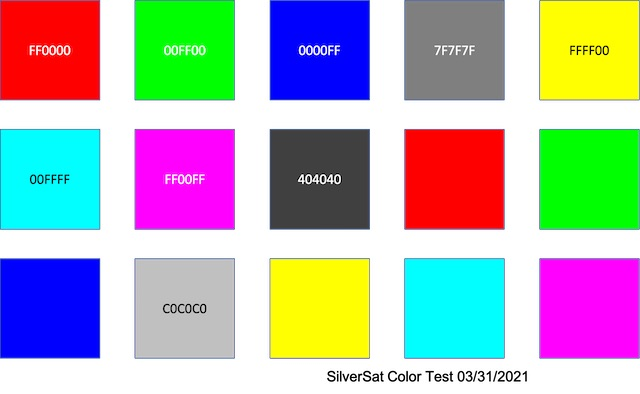

# ucam-image-processing
Code for processing uCAM images before upload to twitter

Requires python modules opencv-python, skimage at least. 

Use rgbpicker.py to determine the RGB triples of specific spots in an image (using your mouse, averaged over a 10x10 pixel spot centered on a mouse click). 

These swatches are in swatches.py for import. swatches.py also has the "true" RGB values of each swatch position. Even though the swatch data has an index, it is not currently used to create a list of RGB values that should match, only the order of the values matters. 

Three approaches are implemented in myccm.py and run in calibrate.py

0) default options for the color_correction module from: https://github.com/riskiest/color_calibration referenced here: https://docs.opencv.org/master/d1/dc1/tutorial_ccm_color_correction_model.html
1) multiple-linear regression on the RGB values (3x3 color correction matrix) based on swatches (inspired and simplified from color_calibration module)
2) multiple-linear regression on the RGB values (3x3 color correction matrix) using a gamma-based linearization with constant 2.2 based on swatches.  (inspired and simplified from color_calibration module)
3) histogram matching of color channels (skimage.exposure.match_histograms), referenced here: https://www.pyimagesearch.com/2021/02/15/automatic-color-correction-with-opencv-and-python/

Images are shown on the screen for comparison.

None of these methods seem particularly effective at producing a "better" image. 

## Reference Image

## uCAM III Image

### Original

### Corrected using color_correction module

### Basic CCM, no gamma correction

### Basic CCM, with gamma correction

### Color histogram matching

